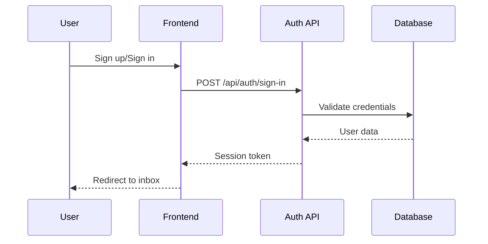
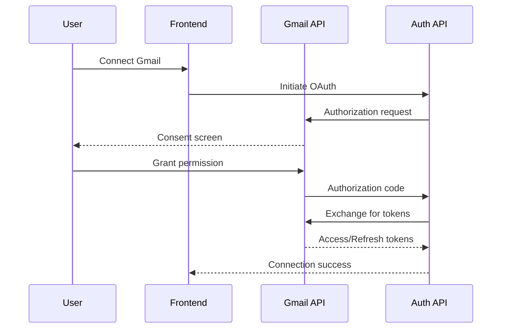
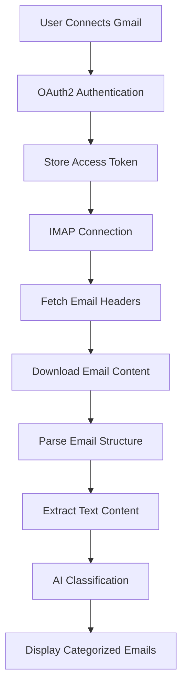

# 🎨 Email Organizer - Design Document

## Overview

Email Organizer is a modern web application that provides intelligent email management through AI-powered classification and secure Gmail integration. This document outlines the technical architecture, design decisions, and implementation details.

## 🎯 Project Goals

### Primary Objectives
- **Email Intelligence**: Automatically classify emails using AI to improve organization
- **Security First**: Implement secure authentication and OAuth2 integration
- **User Experience**: Provide a clean, intuitive interface for email management
- **Scalability**: Design architecture to support future multi-organization features

## 🏗️ System Architecture

### High-Level Architecture
```
┌─────────────────┐    ┌─────────────────┐    ┌─────────────────┐
│   Frontend      │    │   Backend API   │    │  External APIs  │
│   (Next.js)     │◄──►│   (Next.js)     │◄──►│                 │
│                 │    │                 │    │ • Gmail API     │
│ • React UI      │    │ • Auth Routes   │    │ • OpenAI API    │
│ • Auth Client   │    │ • Email Routes  │    │ • IMAP Server   │
│ • State Mgmt    │    │ • AI Routes     │    │                 │
└─────────────────┘    └─────────────────┘    └─────────────────┘
                                │
                                ▼
                       ┌─────────────────┐
                       │   Database      │
                       │   (SQLite)      │
                       │                 │
                       │ • Users         │
                       │ • Sessions      │
                       │ • Accounts      │
                       └─────────────────┘
```

Check the design document for more details on the architecture and components.

https://github.com/your-repo/email-organizer/DESIGN.md

### Technology Stack

#### Frontend
- **Framework**: Next.js 15 with App Router
- **Language**: TypeScript 5.x with strict mode
- **Styling**: Tailwind CSS 3.x
- **Icons**: Lucide React
- **State Management**: React hooks and context

#### Backend
- **Runtime**: Node.js 18+
- **Framework**: Next.js API routes
- **Authentication**: BetterAuth
- **Database**: SQLite with better-sqlite3
- **Email Integration**: Gmail API + IMAP
- **AI Processing**: OpenAI GPT-4

#### Infrastructure
- **Development**: Local development server
- **Deployment**: Static export for GitHub Pages
- **Database**: File-based SQLite
- **Environment**: Environment variables for configuration

## 🔐 Security Architecture

### Authentication Flow


### OAuth2 Integration


### Security Features
- **Session Management**: 7-day expiration with automatic renewal
- **Token Security**: Encrypted storage of OAuth tokens
- **CORS Protection**: Configured trusted origins
- **Input Validation**: Server-side validation for all inputs
- **Database Security**: Parameterized queries to prevent SQL injection

## 📧 Email Processing Pipeline

### Email Fetching Flow


### Classification Categories
- **Work**: Business emails, meetings, professional correspondence
- **Personal**: Family, friends, personal communications
- **Shopping**: E-commerce, receipts, order confirmations
- **Newsletter**: Subscriptions, marketing, updates
- **Support**: Customer service, technical support
- **Other**: Miscellaneous emails not fitting other categories

### AI Classification Process
1. **Content Extraction**: Parse email body and subject
2. **Preprocessing**: Clean and normalize text content
3. **API Request**: Send to OpenAI GPT-4 with classification prompt
4. **Result Processing**: Parse and validate classification response
5. **Storage**: Cache classification results for performance


## 📊 Data Models

### User Schema
```typescript
interface User {
  id: string                    // Primary key
  name: string                  // Full name
  email: string                 // Email address (unique)
  emailVerified: boolean        // Email verification status
  image?: string                // Profile picture URL
  activeOrganizationId?: string // Current organization (future)
  createdAt: Date              // Account creation timestamp
  updatedAt: Date              // Last update timestamp
}
```

### Session Schema
```typescript
interface Session {
  id: string           // Session identifier
  userId: string       // Foreign key to User
  expiresAt: Date     // Session expiration
  ipAddress?: string   // Client IP address
  userAgent?: string   // Client user agent
  token: string       // Session token
  createdAt: Date     // Session creation
  updatedAt: Date     // Last session update
}
```

### Account Schema (OAuth)
```typescript
interface Account {
  id: string              // Account identifier
  userId: string          // Foreign key to User
  accountId: string       // External account ID
  providerId: string      // OAuth provider (gmail)
  accessToken?: string    // OAuth access token
  refreshToken?: string   // OAuth refresh token
  expiresAt?: Date       // Token expiration
  createdAt: Date        // Account linking timestamp
  updatedAt: Date        // Last token refresh
}
```

## 🔮 Future Architecture

### Organization Support (Phase 2)
```typescript
interface Organization {
  id: string              // Organization identifier
  name: string            // Organization name
  slug: string            // URL-friendly identifier
  logo?: string           // Organization logo
  metadata?: any          // Custom organization data
  createdAt: Date         // Creation timestamp
  updatedAt: Date         // Last update timestamp
}

interface OrganizationMember {
  id: string              // Membership identifier
  organizationId: string  // Foreign key to Organization
  userId: string          // Foreign key to User
  role: string            // Member role (owner, admin, member)
  createdAt: Date         // Membership start date
  updatedAt: Date         // Last role update
}
```

### Planned Features
- **Multi-tenancy**: Organization-based data isolation
- **Role-based Access**: Granular permissions system
- **Collaboration**: Shared email classification rules
- **Analytics**: Email processing insights and metrics
- **Mobile App**: React Native mobile application

## 🚀 Deployment Strategy

### Development Environment
- **Local Development**: `npm run dev` with hot reloading
- **Environment Variables**: `.env.local` for sensitive configuration
- **Database**: SQLite file-based storage
- **Debugging**: Built-in Next.js debugging tools

### Production Deployment
- **Static Export**: `npm run build && npm run export`
- **Hosting**: GitHub Pages for static hosting
- **Environment**: Production environment variables
- **Monitoring**: Client-side error tracking
- **Performance**: Optimized bundle sizes and caching

## 🔍 Known Limitations

### Current Constraints
- **Single User**: No multi-user support in current version
- **Organization Features**: Placeholder implementation only
- **Email Storage**: No persistent email storage (fetched on demand)

---
